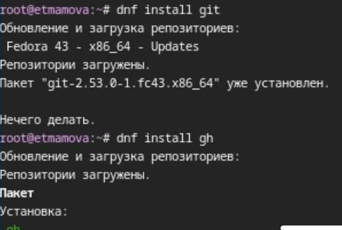
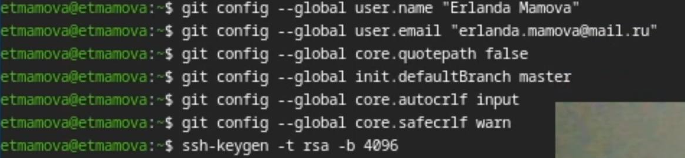
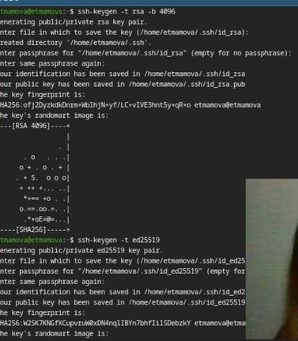
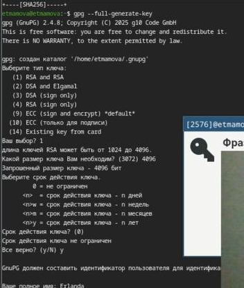
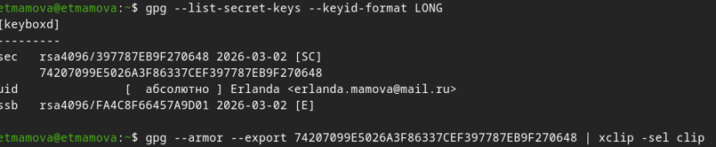
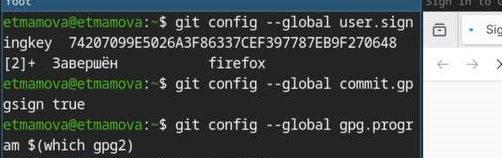
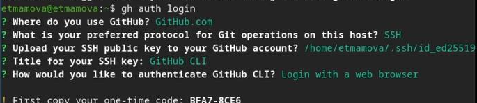
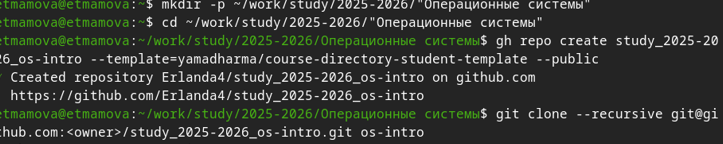
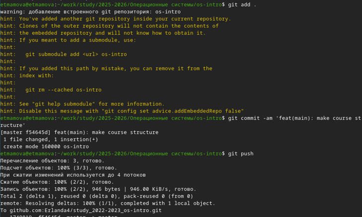

# Лабораторная работа № 2
## Архитектура компьютеров
Студент: Мамова Эрланда Тахировна

Группа: НКА-04-25

---

## Докладчик

  * Мамова Эрланда Тахировна
  * Российский университет дружбы народов им. П. Лумумбы
  * [1032253549@rudn.ru](1032253549@rudn.ru)
  * https://github.com/Erlanda4/study_2025-2026_os-intro

---

### Цель работы

Изучить идеологию и применение средств контроля версий и освоить умения по работе с git

---

#### Задание

Создать базовую конфигурацию для работы с git.
Создать ключ SSH.
Создать ключ PGP.
Настроить подписи git.
Зарегистрироваться на Github.
Создать локальный каталог для выполнения заданий по предмету.

---

##### Теоретическое введение
Системы контроля версий (Version Control System, VCS) применяются при работе нескольких человек над одним проектом. Обычно основное дерево проекта хранится в локальном или удалённом репозитории, к которому настроен доступ для участников проекта. При внесении изменений в содержание проекта система контроля версий позволяет их фиксировать, совмещать изменения, произведённые разными участниками проекта, производить откат к любой более ранней версии проекта

---

###### Выполнение лабораторной работы

установили git и gh

*рисунок 1 - установка*

---

Выполнили базовую настройка git
Задали имя и email владельца репозитория,настроили utf-8 в выводе сообщений git,
задали имя начальной ветки (будем называть её master),параметр autocrlf и safecrlf:

*рисунок 2 - настройка*
Создала ключи ssh

---

*рисунок 3 - ключи ssh*

---

Создала ключи pgp

*рисунок 4 - ключи pgp*

---

вывела список ключей и скопировала отпечаток приватного ключа и скопировала сгенерированный PGP ключ в буфер обмена:

*рисунок 5 - копия ключа*

---

Перешла в настройки GitHub (https://github.com/settings/keys), нажала на кнопку New GPG key и вставила полученный ключ в поле ввода.
Настроила автоматические подписи коммитов git

*рисунок 6 - подписи коммитов*

--- 

авторизировалась

*рисунок 7 - авторизация*

---

 создала шаблон рабочего пространства
 
 *рисунок 8 - шаблон*

Удалила лишние файлы и создала необходимые каталоги:

*рисунок 9 - создание каталогов*

---

Отправила файлы на сервер:

*рисунок 10 - отправка файлов*

---

# Выводы

Мы изучили идеологию и применение средств контроля версий и освоили умения по работе с git
