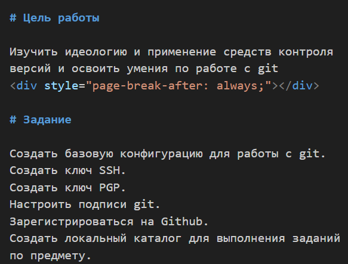
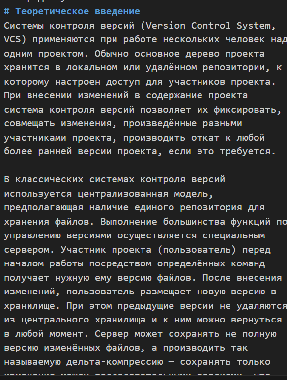

# Лабораторная работа № 3
## Архитектура компьютеров
Студент: Мамова Эрланда Тахировна

Группа: НКА-04-25

---

# Докладчик

  * Мамова Эрланда Тахировна
  * Российский университет дружбы народов им. П. Лумумбы
  * [1032253549@rudn.ru](1032253549@rudn.ru)
  * https://github.com/Erlanda4/study_2025-2026_os-intro

---

# Цель работы

Научиться оформлять отчёты с помощью легковесного языка разметки Markdown.

---

# Задание

– Сделайте отчёт по предыдущей лабораторной работе в формате Markdown.
– В качестве отчёта просьба предоставить отчёты в 3 форматах: pdf, docx и md (в архиве,
поскольку он должен содержать скриншоты, Makefile и т.д.)

---

# Теоретическое введение
Чтобы создать заголовок, используйте знак ( # ), например:
Чтобы задать для текста полужирное начертание, заключите его в двойные звездочки:
Чтобы задать для текста курсивное начертание, заключите его в одинарные звездочки
Чтобы задать для текста полужирное и курсивное начертание, заключите его в тройные
звездочки:

---

# Выполнение лабораторной работы
написала заголовок и содержание

*рисунок 1 -заголовок и содержание*

---

обозначила цель и задание

*рисунок 2 -цель и задание*

---

написала теоретическое введение 

*рисунок 3 -теория*

---

приступила к описанию выполнения лабораторной работы

*рисунок 4 -выполнение*

---

написала вывод и приступила к ответам на вопросы

*рисунок 5 -выводы и ответы*

---

сконвертировала нужные файлы

*рисунок 6 -конвертация*

---

# Выводы
Я научилась оформлять отчёты с помощью легковесного языка разметки Markdown.

