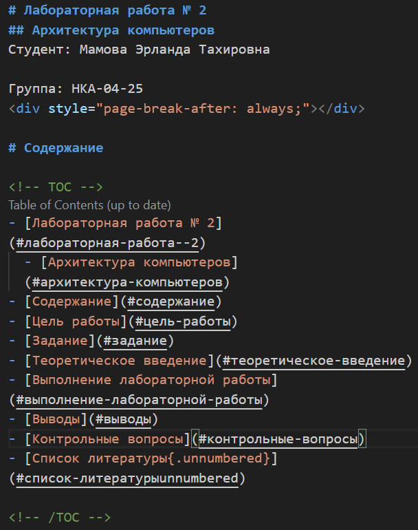
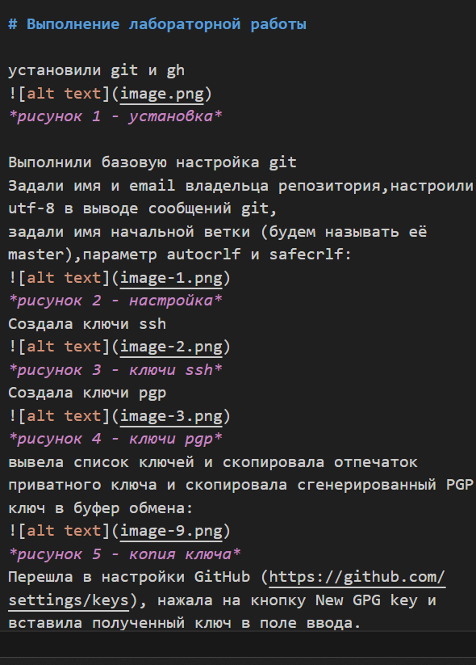
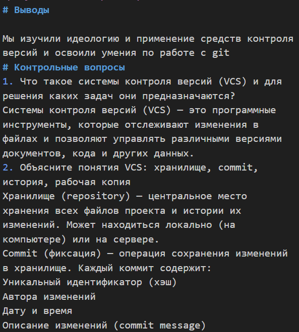
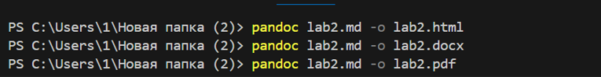

# Лабораторная работа № 3
## Архитектура компьютеров
Студент: Мамова Эрланда Тахировна

Группа: НКА-04-25

 

# Содержание

<!-- TOC -->
- [Лабораторная работа № 3](#лабораторная-работа--3)
  - [Архитектура компьютеров](#архитектура-компьютеров)
- [Содержание](#содержание)
- [Цель работы](#цель-работы)
- [Задание](#задание)
- [Теоретическое введение](#теоретическое-введение)
- [Выполнение лабораторной работы](#выполнение-лабораторной-работы)
- [Выводы](#выводы)

<!-- /TOC -->

# Цель работы

Научиться оформлять отчёты с помощью легковесного языка разметки Markdown.

# Задание

– Сделайте отчёт по предыдущей лабораторной работе в формате Markdown.
– В качестве отчёта просьба предоставить отчёты в 3 форматах: pdf, docx и md (в архиве,
поскольку он должен содержать скриншоты, Makefile и т.д.)

# Теоретическое введение
Чтобы создать заголовок, используйте знак ( # ), например:
1 # This is heading 1
2 ## This is heading 2
3 ### This is heading 3
4 #### This is heading 4
Чтобы задать для текста полужирное начертание, заключите его в двойные звездочки:
1 This text is **bold**.
Чтобы задать для текста курсивное начертание, заключите его в одинарные звездочки:
1 This text is *italic*.
Чтобы задать для текста полужирное и курсивное начертание, заключите его в тройные
звездочки:
1 This is text is both ***bold and italic***.
Блоки цитирования создаются с помощью символа >:

# Выполнение лабораторной работы
написала заголовок и содержание

*рисунок 1 -заголовок и содержание*

обозначила цель и задание

*рисунок 2 -цель и задание*

написала теоретическое введение 

*рисунок 3 -теория*

приступила к описанию выполнения лабораторной работы

*рисунок 4 -выполнение*

написала вывод и приступила к ответам на вопросы

*рисунок 5 -выводы и ответы*

сконвертировала нужные файлы

*рисунок 6 -конвертация*

# Выводы
Я научилась оформлять отчёты с помощью легковесного языка разметки Markdown.

