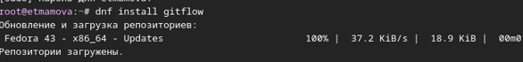
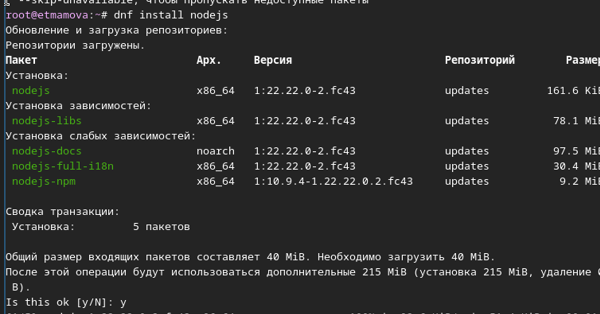
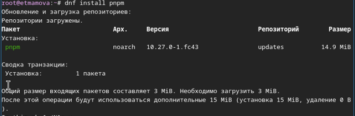
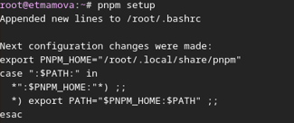
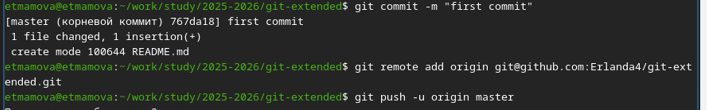
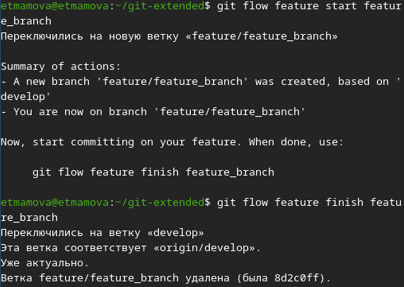
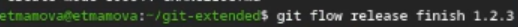
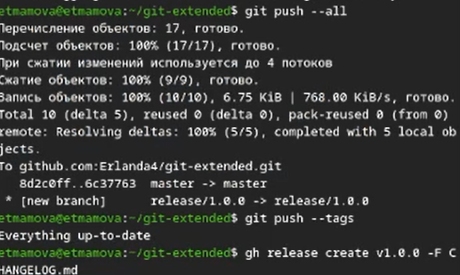

# Лабораторная работа № 4
## Архитектура компьютеров
Студент: Мамова Эрланда Тахировна

Группа: НКА-04-25

---
# Докладчик

  * Мамова Эрланда Тахировна
  * Российский университет дружбы народов им. П. Лумумбы
  * [1032253549@rudn.ru](1032253549@rudn.ru)
  * https://github.com/Erlanda4/study_2025-2026_os-intro

---

# Докладчик

  * Мамова Эрланда Тахировна
  * Российский университет дружбы народов им. П. Лумумбы
  * [1032253549@rudn.ru](1032253549@rudn.ru)
  * https://github.com/Erlanda4/study_2025-2026_os-intro

---

# Цель работы

Получение навыков правильной работы с репозиториями git.

---

# Задание

Выполнить работу для тестового репозитория.
Преобразовать рабочий репозиторий в репозиторий с git-flow и conventional commits.

---

# Теоретическое введение
Gitflow Workflow опубликована и популяризована Винсентом Дриссеном.
Gitflow Workflow предполагает выстраивание строгой модели ветвления с учётом выпуска проекта.
Данная модель отлично подходит для организации рабочего процесса на основе релизов.
Работа по модели Gitflow включает создание отдельной ветки для исправлений ошибок в рабочей среде.

---

# Выполнение лабораторной работы
Установила git-flow

---

и Node.js

*рисунок 2 - Установка Node.js*

*рисунок 3 - Установка Node.js(2)*

---
Настроила Node.js

*рисунок 4 - Настройка Node.js*

*рисунок 5 - Настройка Node.js(2)*

---
Создание репозитория git
Подключила репозиторий к github
Создала репозиторий на GitHub. Назвала его git-extended.
сделала первый коммит и выложила на github

*рисунок 6 - Создание репозитория git*
 
 --- 

выполнила конфигурацию общепринятых коммитов

*рисунок 7 - Конфигурация*

*рисунок 8 - Конфигурация(2)*

*рисунок 9 - Конфигурация(3)*

---
Выполнила конфигурацию git-flow

*рисунок 10 - Конфигурация git-flow*

*рисунок 11 - Конфигурация git-flow(2)*

---
Разработала новую функциональность

*рисунок 12 - функциональность*

---

создала релиз с версией 1.2.3:

*рисунок 13 - релиз с версией 1.2.3*
Создала журнал изменений и добавила в индекс

*рисунок 14 - журнал изменений*

---

Залила релизную ветку в основную ветку

*рисунок 15 - релизная ветка*
---

Отправила данные на github и создала релиз на github с комментарием из журнала изменений

*рисунок 16 - отправка на гит и создание релиза*

---
# вывод
Мы получили навыки правильной работы с репозиториями git.