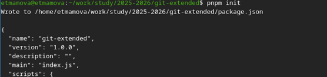
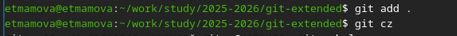
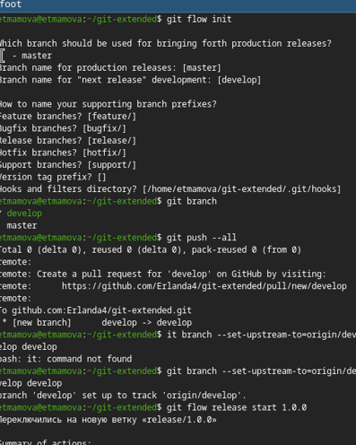
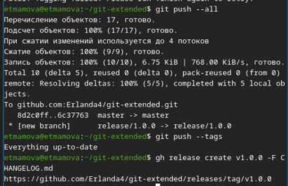
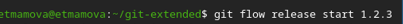
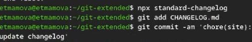

    <h1>РОССИЙСКИЙ УНИВЕРСИТЕТ ДРУЖБЫ НАРОДОВ</h1>
    <h2>Факультет физико-математических и естественных наук</h2>
       
    <h2>Лабораторная работа №4</h2>
    <h1>Установка операционной системы Linux на виртуальную машину</h1>
       
    
<strong>Выполнила:</strong> Мамова Э.Т.

    
<strong>Группа:</strong> НКА-04-25

    
<strong>Преподаватель:</strong> доцент кафедры ...

       
    
Москва, 2026

# Содержание

<!-- TOC -->
- [Содержание](#содержание)
- [Цель работы](#цель-работы)
- [Задание](#задание)
- [Теоретическое введение](#теоретическое-введение)
- [Выполнение лабораторной работы](#выполнение-лабораторной-работы)
- [Выводы](#выводы)

<!-- /TOC -->

# Цель работы

Получение навыков правильной работы с репозиториями git.

# Задание

Выполнить работу для тестового репозитория.
Преобразовать рабочий репозиторий в репозиторий с git-flow и conventional commits.

# Теоретическое введение
Gitflow Workflow опубликована и популяризована Винсентом Дриссеном.
Gitflow Workflow предполагает выстраивание строгой модели ветвления с учётом выпуска проекта.
Данная модель отлично подходит для организации рабочего процесса на основе релизов.
Работа по модели Gitflow включает создание отдельной ветки для исправлений ошибок в рабочей среде.
Последовательность действий при работе по модели Gitflow:
Из ветки master создаётся ветка develop.
Из ветки develop создаётся ветка release.
Из ветки develop создаются ветки feature.
Когда работа над веткой feature завершена, она сливается с веткой develop.
Когда работа над веткой релиза release завершена, она сливается в ветки develop и master.
Если в master обнаружена проблема, из master создаётся ветка hotfix.
Когда работа над веткой исправления hotfix завершена, она сливается в ветки develop и master.

# Выполнение лабораторной работы
Установила git-flow

*рисунок 1 - Установка git-flow*
и Node.js

*рисунок 2 - Установка Node.js*

*рисунок 3 - Установка Node.js(2)*
Настроила Node.js

*рисунок 4 - Настройка Node.js*

*рисунок 5 - Настройка Node.js(2)*
Создание репозитория git
Подключила репозиторий к github
Создала репозиторий на GitHub. Назвала его git-extended.
сделала первый коммит и выложила на github

*рисунок 6 - Создание репозитория git*

выполнила конфигурацию общепринятых коммитов

*рисунок 7 - Конфигурация*

*рисунок 8 - Конфигурация(2)*

*рисунок 9 - Конфигурация(3)*
Выполнила конфигурацию git-flow

*рисунок 10 - Конфигурация git-flow*

*рисунок 11 - Конфигурация git-flow(2)*
Разработала новую функциональность

*рисунок 12 - функциональность*

создала релиз с версией 1.2.3:

*рисунок 13 - релиз с версией 1.2.3*
Создала журнал изменений и добавила в индекс

*рисунок 14 - журнал изменений*
Залила релизную ветку в основную ветку

*рисунок 15 - релизная ветка*
Отправила данные на github и создала релиз на github с комментарием из журнала изменений

*рисунок 16 - отправка на гит и создание релиза*
# Выводы
Мы получили навыки правильной работы с репозиториями git.