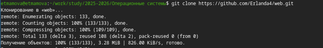
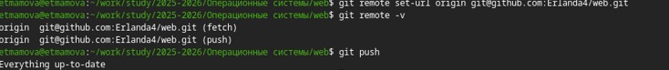

# Индивидуальный проект. Этап1
## Архитектура компьютеров
Студент: Мамова Эрланда Тахировна

Группа: НКА-04-25

---

# Докладчик

  * Мамова Эрланда Тахировна
  * Российский университет дружбы народов им. П. Лумумбы
  * [1032253549@rudn.ru](1032253549@rudn.ru)
  * https://github.com/Erlanda4/study_2025-2026_os-intro

---

# Цель работы

Освоить практические навыки установки и настройки генератора статических сайтов Hugo, развертывания шаблона темы Hugo Academic Theme в локальной среде, публикации исходного кода сайта на хостинге GitHub и активации бесплатного хостинга GitHub Pages для получения доступа к заготовке сайта в интернете.

---

# Задание

Установить необходимое программное обеспечение.
Скачать шаблон темы сайта.
Разместить его на хостинге git.
Установить параметр для URLs сайта.
Разместить заготовку сайта на Github pages.

---

# Выполнение

Установила необходимое программное обеспечение.

---
Скачала шаблон темы сайта.

---
Разместила его на хостинге git.

Установила параметр для URLs сайта.

---
Разместила заготовку сайта на Github pages.

---
# Выводы
Я разместила на Github pages заготовки для персонального сайта.

