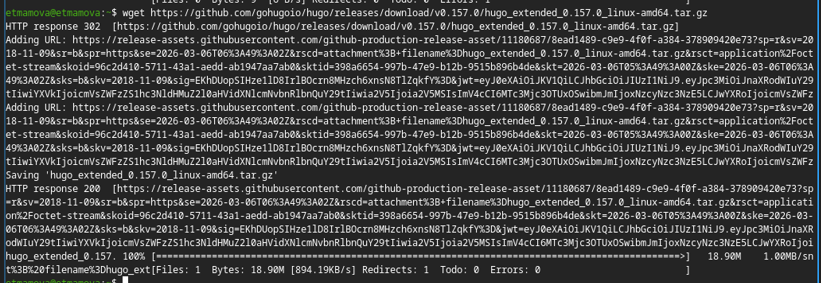

# Индивидуальный проект. Этап 1
## Архитектура компьютеров
Студент: Мамова Эрланда Тахировна

Группа: НКА-04-25

 

# Содержание

<!-- TOC -->
- [Индивидуальный проект. Этап 1](#индивидуальный-проект-этап-1)
  - [Архитектура компьютеров](#архитектура-компьютеров)
- [Содержание](#содержание)
- [Цель работы](#цель-работы)
- [Задание](#задание)
- [Выполнение](#выполнение)
- [Выводы](#выводы)

<!-- /TOC -->

# Цель работы

Освоить практические навыки установки и настройки генератора статических сайтов Hugo, развертывания шаблона темы Hugo Academic Theme в локальной среде, публикации исходного кода сайта на хостинге GitHub и активации бесплатного хостинга GitHub Pages для получения доступа к заготовке сайта в интернете.

# Задание

Установить необходимое программное обеспечение.
Скачать шаблон темы сайта.
Разместить его на хостинге git.
Установить параметр для URLs сайта.
Разместить заготовку сайта на Github pages.

# Выполнение

Установила необходимое программное обеспечение.

Скачала шаблон темы сайта.

Разместила его на хостинге git.

Установила параметр для URLs сайта.

Разместила заготовку сайта на Github pages.

# Выводы
Я разместила на Github pages заготовки для персонального сайта.

